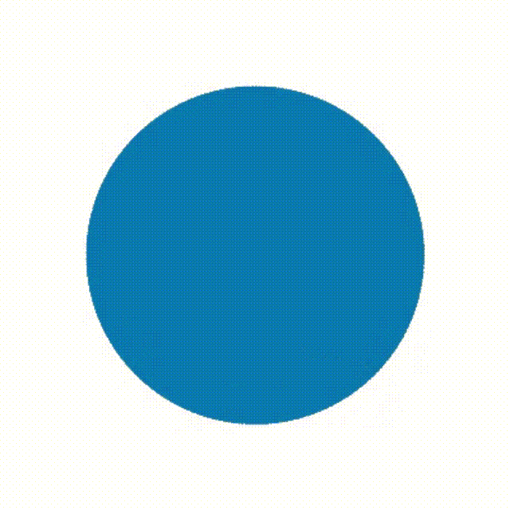

-   :computer: I am working as **Junior DevOps Engineer**
-   :monocle_face: Interested in everything **Cloud Native**
-   :seedling: Currently learning **Python**
-   :heart: Open Source Software
-   :penguin: **Linux** ... it does infinite loops in 5 seconds.
 

| **Linkedin**  | **Twitter**  | **Gmail**  | **Website**  |
|:-:|:-:|:-:|:-:|
| 
 
  |  
 
  | 
 
  | 
 
  |

